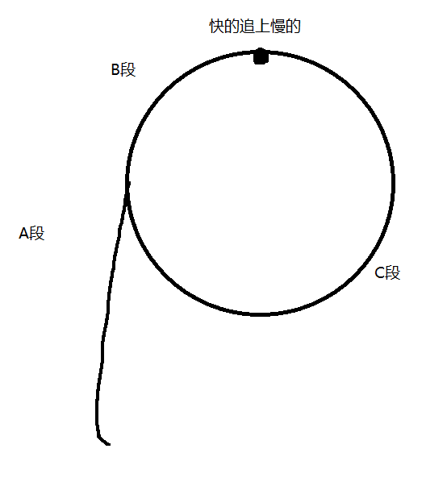

# 刷题

中文名前面的字母意思：
R 回看

----------
## [142.环形链表-ii](https://leetcode.cn/problems/linked-list-cycle-ii/?envType=study-plan-v2&envId=top-100-liked)

设pfast走过2n，则pslow走过n

那么 `a+2b+c = 2*(a+b)`

推算出 `a=c`

只需将pslow和从头开始的指针p开始遍历，直到地址相等，这个地址就是相交的地址

-----------------